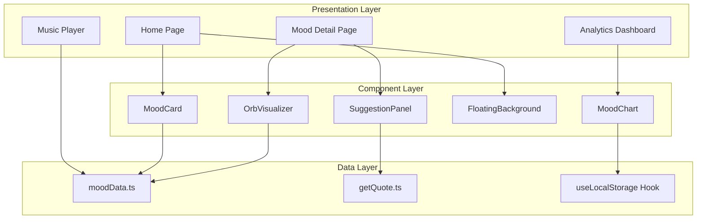
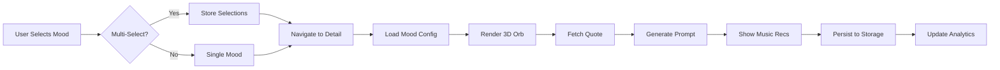
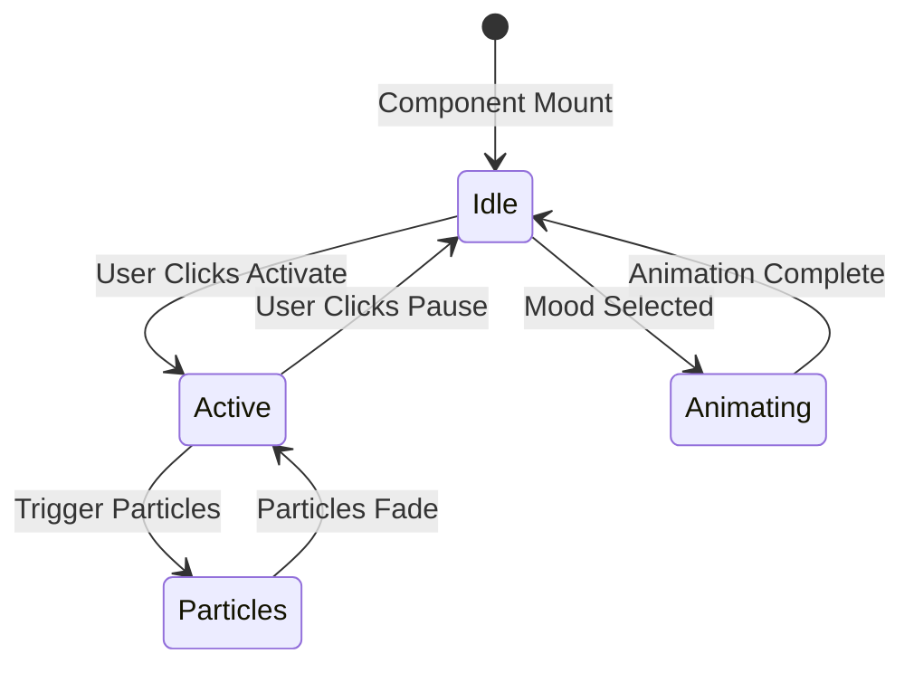

# 🌈 InnerHue - Emotional Reflection Web App

A beautifully animated emotional wellness platform that helps users explore, visualize, and understand their feelings through interactive mood tracking, 3D visualizations, and personalized insights.

<div align="center">


</div>

---

## ✨ Features

### 🎨 Mood Selection
- **38 Emotional States**: From happiness to melancholy, each with unique colors and personalities
- **Floating Card Interface**: Disney-inspired 3D animations with shimmer and hover effects
- **Intuitive Design**: Beautiful gradient backgrounds and smooth transitions

### 🔮 3D Orb Visualizer
- **Dynamic Visualization**: Interactive orbs that change color, glow, and animation based on selected mood
- **Particle Effects**: Floating particles and ripple rings for immersive experience
- **Responsive Animations**: Smooth Framer Motion animations with customizable states

### 💬 AI-Powered Suggestions
- **Journal Prompts**: Thoughtful questions tailored to your emotional state
- **Inspirational Quotes**: Curated quotes from renowned authors and thinkers
- **Keyword Clouds**: Emotion-related words to expand emotional vocabulary
- **Music Recommendations**: Spotify-style playlists matching your mood

### 📊 Analytics Dashboard
- **Mood Tracking**: Visual charts showing emotional patterns over time
- **Statistics**: Daily, weekly, and overall mood insights
- **Recent Activity**: Timeline of your emotional journey
- **Progress Visualization**: Beautiful bar and pie charts

### 🎵 Music Integration
- **Curated Playlists**: Genre-specific music recommendations for each mood
- **Interactive Player**: Play/pause functionality with beautiful UI
- **Mood-Based Organization**: Easy switching between emotional soundscapes

---

## 🛠️ Tech Stack

- **Frontend**: Next.js 13 with App Router
- **Styling**: TailwindCSS with custom design system
- **Animations**: Framer Motion for smooth, professional animations
- **Icons**: Lucide React for consistent iconography
- **Data Storage**: Local Storage for client-side persistence
- **TypeScript**: Full type safety throughout the application

---

## 🗺️ System Architecture

### High-Level Component Map



### Emotional Reflection Pipeline



### 3D Orb State Management



---

## 🎯 Design Philosophy

InnerHue follows **Apple-level design aesthetics** with:
- **Glassmorphism**: Backdrop blur effects and translucent cards
- **Micro-interactions**: Subtle hover states and tap feedback
- **Color Psychology**: Carefully chosen colors that match emotional states
- **Responsive Design**: Mobile-first approach with perfect cross-device experience
- **Accessibility**: High contrast ratios and intuitive navigation

---

## 🚀 Getting Started

Quick start for local development:

```bash
# Clone the repository
git clone https://github.com/Nitya-003/innerhue.git
cd innerhue

# Install dependencies
npm install

# Run the development server
npm run dev
```

For detailed setup instructions, environment configuration, and troubleshooting, see [SETUP.md](./SETUP.md).

---

## 🎨 Color System

InnerHue uses a comprehensive emotional color palette:
- **Happy**: Golden yellows (#FFD93D)
- **Calm**: Peaceful greens (#66BB6A)
- **Sad**: Soothing blues (#42A5F5)
- **Excited**: Vibrant purples (#AB47BC)
- **Anxious**: Warm oranges (#FF7043)

---

## 🔄 2026 Roadmap

### Q1 2026
- [ ] **User Authentication**: Secure login with NextAuth.js
- [ ] **Cloud Sync**: Backup mood history to cloud storage
- [ ] **Enhanced Analytics**: Weekly/monthly trend reports

### Q2 2026
- [ ] **AI-Powered Insights**: OpenAI integration for personalized suggestions
- [ ] **Voice Journaling**: Audio recordings with sentiment analysis
- [ ] **Social Sharing**: Share mood insights with friends

### Q3 2026
- [ ] **Mobile App**: React Native companion app
- [ ] **Wearable Integration**: Apple Watch and Fitbit mood tracking
- [ ] **Meditation Module**: Guided meditations based on mood

### Q4 2026
- [ ] **Community Features**: Anonymous mood boards
- [ ] **Therapist Integration**: Professional dashboard
- [ ] **Advanced NLP**: Cohere API for deeper emotional analysis

---

## 🤝 Contributing

We welcome contributions! Please feel free to submit a Pull Request. For major changes, please open an issue first to discuss what you would like to change.

## 📄 License

This project is licensed under the MIT License - see the [LICENSE](LICENSE) file for details.

## 🙏 Acknowledgments

- **Framer Motion** for incredible animation capabilities
- **TailwindCSS** for the flexible design system
- **Next.js** for the amazing developer experience
- **Inspiration** from emotional wellness platforms and modern design trends

---

**InnerHue** - *Discover the colors of your emotions* 🌈✨
